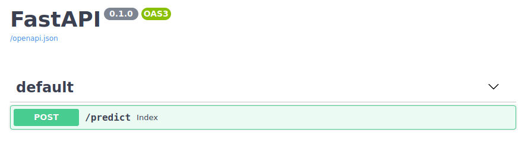
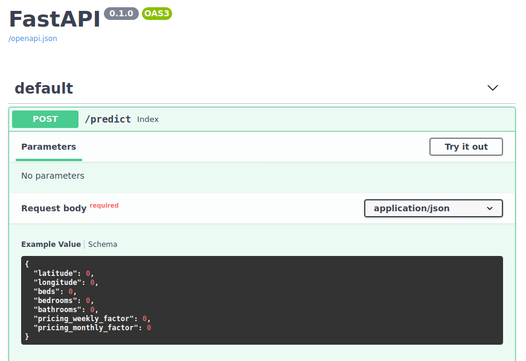
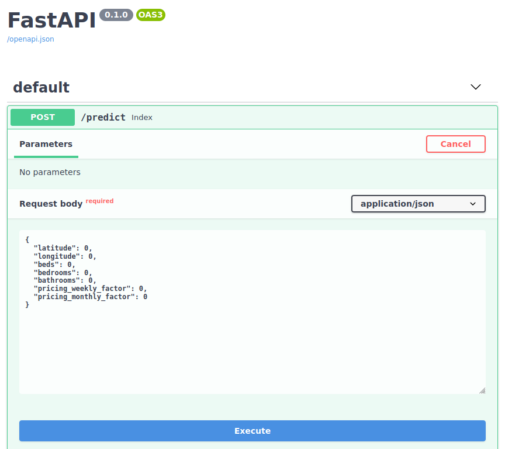

# ML Template API

<!-- START doctoc generated TOC please keep comment here to allow auto update -->
<!-- DON'T EDIT THIS SECTION, INSTEAD RE-RUN doctoc TO UPDATE -->
**Table of Contents**  *generated with [DocToc](https://github.com/thlorenz/doctoc)*

- [Présentation](#pr%C3%A9sentation)
  - [Liens vers les datasets](#liens-vers-les-datasets)
- [Utilisation](#utilisation)
  - [Lien vers l'API](#lien-vers-lapi)

<!-- END doctoc generated TOC please keep comment here to allow auto update -->

## Présentation

Ce projet est un exemple de structure de projet de Cloud computing avec une API de prédiction (Machine Learning). L'API, déployée dans un conteneur Docker et sur un serveur distant Heroku, se base sur deux modèles de données : 
- **listing_final.csv**, qui est un modèle de données utilisé par AirBNB répertoriant un ensemble de logements avec leurs informations
- **price_availability.csv**, qui retrace les informations de locations de ces logements

L'API a pour but de prédire le prix d'un logement en fonction d'un ensemble de critères.

### Liens vers les datasets
- **listing_final.csv** : https://storage.googleapis.com/h3-data/listings_final.csv
- **price_availability.csv** : https://storage.googleapis.com/h3-data/price_availability.csv

Ces données sont passées dans une pipeline selon le procédé suivant :
1. **DataHandler** : Interception et initialisation des données des deux datasets

2. **FeatureRecipe** : Phase de data cleaning (nettoyage des données)

3. **FeatureExtractore** : Récupération des données nettoyées et préparation de l'entrainement des données

4. **ModelBuilder** : Entrainement des données et finalisation du modèle de données

## Utilisation

L'API se base sur l'algorithme de régression linéaire afin d'effectuer une prediction sur le prix d'un logement selon sa latitude, sa longitude, ses facteurs de prix hebdomadaire et mensuel, sa capacité (nombre de personnes) ainsi que le nombre de salles de bain, de chambres et de lits dont elle dispose.

Tous ces paramètres doivent donc être saisis lors de l'appel de API afin d'obtenir une prédiction du prix de ce logement.

### Lien vers l'API
- https://ml-template-api.herokuapp.com/docs

Une fois sur l'interface de gestion de l'API, un point de terminaison "/predict" est à disposition :

En cliquant sur ce endpoint, un menu sera déroulé avec des information concernant ce dernier :

Cliquez sur "Try it out" pour essayer ce endpoint, saisissez les valeurs des paramètres demandés et cliquez sur "Execute"

L'API retourne l'estimation du prix du logement en fonction des critères saisis.